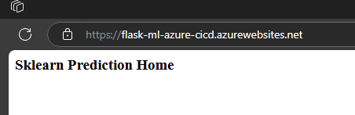

[](https://github.com/TuNguyen16/udacity-azure-cicd/actions/workflows/pythonapp.yml)

# Overview

This project setup and deploy a Flask-Sklearn machine learning API to Azure App Service, using GitHub Action for continuous integration (build, verify and test the application) and Azure Pipeline for continuous delivery (automatically deploy to Azure App Service)

## Project Plan

-   [Trello Board](https://trello.com/b/UZNFxhCX/udacity-azure-ci-cd)
-   [Spreadsheet Plan](https://docs.google.com/spreadsheets/d/1oBQF8qZ_0K8sX3t5rxY5iIvQMtmtKMuquPpY9RhSvQw/edit?usp=sharing)

## Instructions

### Architectural Diagram


### Local run

1. Login to Azure Portal and open **Azure Cloud Shell**
2. Clone this project using this command
    ```bash
    git clone https://github.com/TuNguyen16/udacity-azure-cicd
    ```
    Output should look like this
    
3. Run this command to build and test the application.
    ```bash
    make all
    ```
    Here are the test result
    

### GitHub Action for CI

1. Create your own GitHub repo and push this source onto it
2. The GitHub Action workflow should work and display passed result like this
   

### Azure Pipeline for CD

1. First, let test deploy manually using this command (replace \<name-here\> with the name you want, I'm using flask-ml-azure-cicd as the name)
    ```bash
    az webapp up -n <name-here> --sku F1
    ```
    - If success, access `https://<name-here>.azurewebsites.net/` should return this page
      
2. Go to Azure Portal and search for **Azure Devops organization**
3. **(IMPORTANT)** Create self-hosted agent pool to run the pipeline,
    - Go to **Project settings**
    - At **Pipelines** section, click Agent Pools
    - Click **Add pool** button
    - Choose **Self-hosted** pool type and give it a name
    - Check **Grant access permission to all pipelines** option
    - Download **Docker Desktop** and install it
    - Start **Docker Desktop**
    - Open **azure-agent** folder and update the **Dockerfile** to configure agent (There are detail instruction inside the file on how to configure it)
    - Navigate to **azure-agent** folder in terminal and run those command in order (replace \<name-here\> with any name you want)
    ```bash
    docker build -t <name-here>/azure-agent .
    docker run --name azure-agent -d <name-here>/azure-agent
    ```
    - **Note:** Everytime you need to update the agent configuration in the **Dockerfile** above, you must first remove the agent in the Project settings of the Azure Devops organization first before run the above command again
4. With the agent setup, time to create the pipeline
    - Back to project homepage of the **Azure Devops organization**
    - Select **Pipelines -> Pipelines -> New pipeline**
    - At **Where is your code?**, select **GitHub**
    - Authorize your GitHub account to select the GitHub repo you just created above
    - At **Configure your pipeline**, select **Existing Azure Pipelines YAML file**
    - Select branch name and select **/azure-pipelines.yml** file
    - Update **azureSubscription** and **WebAppName** to your subscription on Azure Portal and you web app name respectively
    ```yml
    - task: AzureRmWebAppDeployment@4
    inputs:
        ConnectionType: 'AzureRM'
        azureSubscription: '<azure-subscription>'
        appType: 'webApp'
        WebAppName: '<web-app-name-here>'
        package: '$(System.DefaultWorkingDirectory)'
    ```
    - Click **Run** button
    - If everything is good then you will see the same page when access the link at deploy manually step above
    - The result on Azure Pipeline also show success
      
    - Log stream of the successfully deploy App Service
      
5. Try do the prediction to the API of the application just deploy

    - Update `https://<name-here>.azurewebsites.net:$PORT/predict` in **make_predict_azure_app.sh** file, replace \<name-here\> with the same name you set for WebAppName above
    - Execute prediction using this command:

    ```bash
    ./make_predict_azure_app.sh
    ```

    - The result should be something like this
      

## Enhancements

The self-hosted agent still using another VM or other machine with installed Docker in order to work. In the future, this will be replace with automation VM creation on Azure and setup agent on that VM instead

## Demo

https://youtu.be/Un67y5c7N4I
